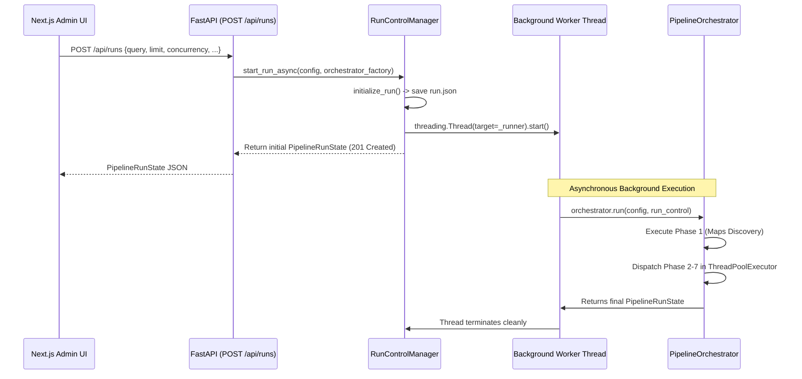

# Backend Architecture — FastAPI Control Plane

The backend control plane is implemented with **FastAPI** in `api/app.py` and served via **Uvicorn** in `api/server.py`. It bridges the Next.js Operations Console and the multithreaded Python pipeline.

---

## 1. Module Structure & Architecture

```text
api/
├── __init__.py
├── app.py                # FastAPI route handlers, CORS middleware, SSE streaming generator
├── models.py             # Pydantic request & response models for the control plane
└── server.py             # Uvicorn CLI runner script
```

---

## 2. Shared Singletons & State Management

The FastAPI application maintains three thread-safe singleton managers initialized at application startup:

```python
# Shared singletons in api/app.py
state_mgr = RunStateManager()
event_mgr = EventManager()
control_mgr = RunControlManager(state_manager=state_mgr, event_manager=event_mgr)
```

1. **`state_mgr` (`RunStateManager`)**:
   - Manages directory layout in `data/runs/<run_id>/`.
   - Loads and writes `run.json` and `businesses/<business_id>.json`.
   - Uses atomic temporary file write and replacement to eliminate partial file reads during concurrent worker updates.
2. **`event_mgr` (`EventManager`)**:
   - Appends structured `PipelineEvent` records into `data/runs/<run_id>/events.jsonl`.
   - Protects write access via per-run reentrant locks (`threading.RLock`).
   - Powers the SSE live-tailing streaming generator.
3. **`control_mgr` (`RunControlManager`)**:
   - Maintains an in-memory dictionary of running worker threads (`_threads: Dict[str, threading.Thread]`) and control primitives (`_controls: Dict[str, RunControl]`).
   - Coordinates thread pausing, resuming, cancellation, and retry operations across the worker pool.

---

## 3. Worker Thread Lifecycle

When a run is launched via `POST /api/runs`:



### Thread Safety & Non-Blocking Design
- The FastAPI request thread **never blocks** waiting for the pipeline to complete. It initializes state on disk, spawns a daemon worker thread, and returns HTTP 201 with the initial `PipelineRunState`.
- If the server receives a cancellation request (`POST /api/runs/{id}/cancel`), `control_mgr.cancel_run()` sets the cancellation `threading.Event`, causing workers to cleanly abort at their next stage boundary.

---

## 4. Server-Sent Events (SSE) Streaming Engine

Real-time telemetry is streamed to browser clients via `GET /api/runs/{run_id}/events?stream=true`:

```python
@app.get("/api/runs/{run_id}/events", tags=["Events"])
async def get_run_events(run_id: str, request: Request, stream: bool = False, ...):
    if is_sse:
        async def event_generator():
            yield ": keep-alive\n\n"
            async for event in event_mgr.stream_events(
                run_id=run_id,
                since_timestamp=since,
                poll_interval=0.2,
                is_active_check=lambda: control_mgr.is_run_active(run_id),
            ):
                data = event.model_dump_json()
                yield f"event: message\ndata: {data}\n\n"
            yield "event: end\ndata: {}\n\n"

        return StreamingResponse(
            event_generator(),
            media_type="text/event-stream",
            headers={
                "Cache-Control": "no-cache",
                "Connection": "keep-alive",
                "X-Accel-Buffering": "no",
            },
        )
```

### SSE Streaming Mechanics
1. **Initial Historical Flush**: When a client connects, the generator reads all existing events from `data/runs/<run_id>/events.jsonl` matching any `since` timestamp or severity filter, immediately populating the frontend viewer.
2. **File Tailing Loop**: Once historical events are flushed, the generator sleeps for 200ms (`await asyncio.sleep(poll_interval)`) and checks for newly appended lines.
3. **Keep-Alive & Clean Disconnect**: Sends `: keep-alive\n\n` comments to prevent proxy socket timeouts. When the client disconnects, `request.is_disconnected()` terminates the async generator loop.

---

## 5. Middleware & Configuration

### CORS Middleware
```python
app.add_middleware(
    CORSMiddleware,
    allow_origins=["*"],
    allow_credentials=True,
    allow_methods=["*"],
    allow_headers=["*"],
)
```
- **Auditor Note**: Configured with wildcard origins for local development between port 3000 (Next.js) and port 8000 (FastAPI). In a production deployment, `allow_origins` must be locked down to the specific administrative domain.

---

## 6. Server Runner (`api/server.py`)

The server is invoked via:
```bash
python main.py server --host 127.0.0.1 --port 8000 --reload
```
or directly:
```bash
python -m api.server --port 8000
```
- Wraps `uvicorn.run("api.app:app", host=host, port=port, reload=reload, log_level="info")`.
- Exposes interactive Swagger UI at `http://127.0.0.1:8000/docs` and OpenAPI JSON at `/openapi.json`.
