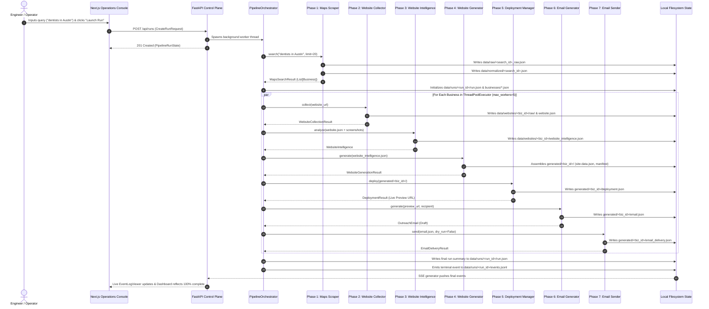

# End-to-End Data Flows & Persistence Model

This document traces the complete end-to-end data progression through Nayom, detailing transformations, filesystem persistence boundaries, and state lifecycle.

---

## 1. Complete End-to-End Pipeline Workflow



---

## 2. Granular Stage-by-Stage Transformations

### Stage 0: Trigger & Initialization
1. **User Action**: The operator submits a query in `admin/app/page.tsx`.
2. **HTTP Dispatch**: `createRun()` in `admin/lib/api.ts` dispatches `POST /api/runs` to FastAPI.
3. **Run Registration**: `RunControlManager.start_run_async()` generates a canonical `run_id`:
   $$\text{run\_YYYYMMDD\_HHMMSS\_slug}$$
4. **Initial Disk Persistence**: `RunStateManager.initialize_run()` writes `data/runs/<run_id>/run.json` with status `"running"`.
5. **Worker Launch**: A background daemon thread is spawned, and FastAPI returns HTTP 201 immediately.

### Stage 1: Google Maps Scraper (Discovery)
1. **Geocoding**: `NominatimGeocoder` queries OpenStreetMap to obtain the bounding box `(min_lat, max_lat, min_lon, max_lon)`.
2. **Grid Generation**: Calculates bounding box width/height and dynamically generates spatial grid coordinates.
3. **Subprocess Scrape**: Subprocess invokes `google-maps-scraper.exe` with `-fast-mode -geo {lat},{lon}`.
4. **Normalization & Usability**:
   - `modules/maps_scraper/adapter.py` normalizes raw JSON entries into `Business` models.
   - Computes `usable: bool` (true if `name` + phone/email/website is present).
   - Deduplicates across tiles via Place ID, Data ID, and Phone.
5. **Persistence**:
   - Consolidated raw JSON: `data/raw/<search_id>_raw.json`.
   - Clean normalized records: `data/normalized/<search_id>.json`.
   - Per-business state checkpoints: `data/runs/<run_id>/businesses/<business_id>.json`.

### Stage 2: Website Collector (DOM & Screenshots)
1. **Prerequisite Check**: If `not business.website`, marks stage `"skipped"` ("No website URL provided").
2. **Crawling**: MarkCrawl engine traverses internal domain pages up to `max_pages=20`.
3. **DOM Extraction**: BeautifulSoup parses HTML into `Page` objects: headings, links, images, meta tags, forms, CTAs, JSON-LD schemas.
4. **Persistence**:
   - Page dumps: `data/websites/<site_id>/raw/pages.jsonl`.
   - Screenshots: `data/websites/<site_id>/raw/screenshots/*.png`.
   - Normalized artifact: `data/websites/<site_id>/website.json`.

### Stage 3: AI Website Intelligence (Gemini Multimodal)
1. **Prerequisite Check**: Requires `website_collector == "completed"`.
2. **Context Window Packaging**: Truncates homepage text (8,000 chars) and inner pages (3,000 chars).
3. **Multimodal Reasoning**: Bundles page markdown and up to 5 screenshot images into `google.genai.Client.models.generate_content`.
4. **Schema Enforcement**: Constrains model output using Pydantic schema `WebsiteIntelligence`.
5. **Persistence**:
   - Output: `data/websites/<site_id>/website_intelligence.json`.

### Stage 4: Deterministic Website Generator
1. **Template Selection**: `TemplateSelector` queries `templates/registry.json` and scores candidates.
2. **Directory Assembly**: Copies template directory to `generated/<business_id>/`, ignoring build artifacts (`.next`, `node_modules`).
3. **Slot Population**: `SlotPopulator` maps intelligence profile and crawled images into `site-data.json`.
4. **Persistence**:
   - Codebase: `generated/<business_id>/`.
   - Data token file: `generated/<business_id>/site-data.json`.
   - Generation metadata: `generated/<business_id>/generator-manifest.json`.

### Stage 5: Multi-Provider Deployment
1. **Provider Selection**: `DeploymentManager` checks `data/deployment_state.json` to select the next provider in round-robin order.
2. **Build Execution**: `ensure_static_build()` runs `npm run build` if static export (`out/`) is required.
3. **Cloud Dispatch**: Invokes provider CLI (`npx vercel`, `npx wrangler`, Netlify ZIP upload, `npx gh-pages`).
4. **SSO Patch**: For Vercel, issues PATCH request to disable SSO deployment protection for public viewing.
5. **Persistence**:
   - Deployment contract: `generated/<business_id>/deployment.json`.
   - Rotation state: `data/deployment_state.json`.

### Stage 6: Personalized Email Generator
1. **Preview URL Resolution**: Loads live URL from `generated/<business_id>/deployment.json`.
2. **Recipient Email Resolution**: Extracts verified contact email from business intelligence.
3. **AI Drafting**: Gemini generates compelling, non-salesy cold outreach highlighting UX friction points discovered during crawling and inviting the owner to view the live preview link.
4. **Persistence**:
   - Email contract: `generated/<business_id>/email.json`.

### Stage 7: Email Sender
1. **Safety Pre-Checks**:
   - Validates recipient email syntax (`is_valid_email()`).
   - Checks opt-out suppression list (`data/email_suppression_list.json`).
   - Verifies daily quota in `data/email_sending_state.json`.
2. **Dispatch**: Transmits message via Resend, SendGrid, Gmail SMTP, Outlook SMTP, or Custom SMTP.
3. **Persistence**:
   - Delivery record: `generated/<business_id>/email_delivery.json`.
   - Sending state & counters: `data/email_sending_state.json`.

---

## 3. Storage Architecture & Persistence Guarantees

The entire Nayom architecture operates **without an external relational database**, relying entirely on deterministic filesystem structures:

```text
data/
├── raw/                                  # Immutable raw JSON output from Maps Scraper
├── normalized/                           # Clean normalized Business records
├── websites/
│   └── <site_id>/
│       ├── raw/                          # Crawled pages.jsonl & screenshots
│       ├── website.json                  # Normalized extracted website DOM
│       └── website_intelligence.json     # Multimodal Gemini intelligence extraction
├── runs/
│   └── <run_id>/
│       ├── run.json                      # Top-level run state, configuration, and summary
│       ├── events.jsonl                  # Append-only structured event log
│       └── businesses/
│           └── <business_id>.json        # Granular per-business checkpoint state
├── deployment_state.json                 # Round-robin provider index & deployment counts
├── email_sending_state.json              # Daily sent counts & 00:00 UTC quota reset dates
└── email_suppression_list.json           # Permanent opt-out / unsubscribe list
```

### Atomic File Persistence Pattern
To prevent file corruption during concurrent worker execution, all shared JSON writes use the atomic `.tmp` + `replace()` pattern protected by `threading.Lock`:

```python
temp_file = target_file.with_suffix(".tmp")
with open(temp_file, "w", encoding="utf-8") as f:
    json.dump(payload, f, indent=2)
temp_file.replace(target_file)  # Atomic on both Windows (NTFS) and Linux (ext4)
```
