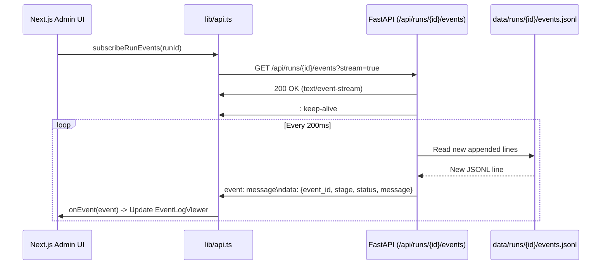

# Frontend Architecture — Next.js Operations Console

The Nayom Operations Console is located in `admin/` and serves as the real-time mission control interface for the automation platform.

---

## 1. Technology Stack & Framework Architecture

- **Framework**: Next.js 14.2.3 (App Router)
- **Runtime**: React 18.3.1, Node.js 18+
- **Styling**: Tailwind CSS 3.4.3 with custom console design tokens (`tailwind.config.ts`, `globals.css`)
- **Icons**: Lucide React 0.378.0
- **Type Safety**: TypeScript 5.4.5 in strict mode
- **Build Output**: Static pre-rendering for root routes + Dynamic client-side rendering for drilldown pages

---

## 2. Layout & Routing Structure

```text
admin/
├── app/
│   ├── layout.tsx                # Root layout with console header, telemetry indicators & footer
│   ├── page.tsx                  # Primary dashboard (stats, run creation form, historical runs table)
│   ├── globals.css               # Design tokens, CRT effects, status indicators
│   ├── runs/
│   │   └── [id]/
│   │       └── page.tsx          # Single run drilldown (funnel, SSE event viewer, business cards)
│   └── businesses/
│       └── [id]/
│           └── page.tsx          # Single business inspection (all 7 stage artifacts & logs)
├── components/
│   ├── EventLogViewer.tsx        # High-frequency SSE event log terminal with level & stage filters
│   ├── MetricsBar.tsx            # Global telemetry statistic counters
│   ├── StageFunnel.tsx           # Conversion funnel visualizing business drop-off per stage
│   └── WorkerMonitor.tsx         # Active worker pool thread visualizer
└── lib/
    └── api.ts                    # API client, TypeScript contracts, REST fetchers & SSE listener
```

---

## 3. Core Pages & Component Mechanics

### 1. Root Layout (`admin/app/layout.tsx`)
- Enforces dark mode console aesthetic (`bg-console-bg text-console-text`).
- Houses the sticky top Operations Command Bar with links to Dashboard (`/`) and API Docs (`http://127.0.0.1:8000/docs`).
- Displays live telemetry indicators: `ENGINE ONLINE` and `7-STAGE PIPELINE`.

### 2. Primary Dashboard (`admin/app/page.tsx`)
- **Inputs**: Preset query buttons ("dentists in Austin Texas", "roofers in Miami Florida", etc.) or custom user input.
- **Advanced Controls**:
  - `limit` (1 to 500 businesses)
  - `concurrency` (1 to 50 workers)
  - `dry_run` toggle (simulates email delivery)
  - `ai_provider` override (`gemini`, `mock`)
  - `deploy_provider` override (`vercel`, `cloudflare`, `netlify`, `github_pages`, `render`, `firebase`, `mock`)
  - `email_provider` override (`gmail`, `resend`, `sendgrid`, `outlook`, `smtp`, `mock`)
  - `fast_mode` toggle for Maps Scraper
  - `render_js` and `screenshot` toggles for Website Collector
- **State & Data Fetching**:
  - Uses `useCallback` and `useEffect` with a **2,500ms short-polling interval** calling `Promise.all([getGlobalStats(), getRuns(100)])`.
- **Run Table & Actions**:
  - Displays all runs sorted newest first with status badges (`running`, `completed`, `failed`, `paused`, `cancelled`).
  - Action buttons: Pause (`pauseRun`), Resume (`resumeRun`), Cancel (`cancelRun`), and Retry (`retryRun`).

### 3. Run Drilldown Page (`admin/app/runs/[id]/page.tsx`)
- **Purpose**: Deep operational view of an active or historical run.
- **Stage Funnel**: Visualizes conversion from Discovery -> Scraped -> Intelligence -> Generated -> Deployed -> Email Generated -> Email Sent.
- **Live SSE Event Viewer (`components/EventLogViewer.tsx`)**:
  - Subscribes via `subscribeRunEvents(runId)`.
  - Color-coded severity tags (`info` = cyan, `warning` = amber, `error` = rose, `success` = emerald).
  - Search filter, stage filter, severity filter, and auto-scroll toggle.
- **Business Cards Grid**: Displays card for each business showing current executing stage, status badge, duration, and direct links to inspect the business.

### 4. Deep Business Inspection (`admin/app/businesses/[id]/page.tsx`)
- **Purpose**: Single-pane-of-glass forensic inspection of a single business across all 7 stages.
- **Artifact Panels**:
  - **Stage 0 (Discovery)**: Maps record, rating, review count, address, place ID.
  - **Stage 1 (Scraper)**: Crawled pages count, headings, discovered links, forms.
  - **Stage 2 (Intelligence)**: Brand tone, value proposition, services catalog, UX audit, redesign recommendations.
  - **Stage 3 (Generator)**: Selected template, populated slot count, `site-data.json` viewer.
  - **Stage 4 (Deployment)**: Provider used, live preview URL, and embedded live iframe preview.
  - **Stage 5 (Email Gen)**: Subject line, key improvements, recipient email, full personalized email copy.
  - **Stage 6 (Email Sender)**: Delivery status (`sent`, `dry_run`, `skipped`), provider used, message ID.
  - **Audit Trail**: Filtered timeline of all structured events associated with this business ID.

---

## 4. API Communication & SSE Event Handling



---

## 5. Frontend Failure Modes & Defensive Strategies

1. **FastAPI Backend Offline**:
   - If FastAPI server on port 8000 is stopped, fetch requests in `lib/api.ts` catch network errors.
   - The UI displays an amber warning banner: "Unable to connect to control plane API on http://127.0.0.1:8000. Ensure 'python main.py server' is running."
2. **SSE Connection Drop**:
   - The native browser `EventSource` automatically retries connection every 3 seconds if disconnected.
   - When the connection resumes, `since` query parameter ensures missed events are backfilled.
3. **Optimistic Action State**:
   - When Pause or Resume is clicked, `actionLoading` locks the button spinner and immediately updates local state before the next poll cycle reconciles from disk.
