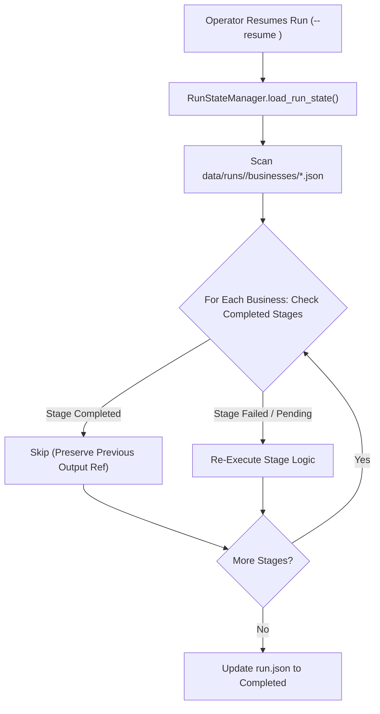

# Failure Modes, Disaster Recovery & State Resilience

This document outlines how Nayom handles sudden crashes, process interruptions, transient network faults, rate-limit exhaustion, and file corruption.

---

## 1. Resilience Architecture & Checkpointing

Nayom is designed to survive sudden process termination (`SIGKILL`, power loss, or terminal abort) without losing completed work.



---

## 2. Checkpoint & Resume Mechanics (`--resume`)

When a campaign is launched with the `--resume <run_id>` flag (or resumed via the Operations Console):

1. **State Hydration**:
   - `RunStateManager` loads the top-level `run.json`.
   - Discovers all individual business states in `data/runs/<run_id>/businesses/*.json`.
2. **Stage Bypass Logic**:
   - For each business, `PipelineOrchestrator._process_single_business()` iterates through the 7 stages.
   - For each stage, it checks `stage_execution.status == "completed"` AND verifies that `output_ref` exists on disk.
   - If both conditions are met, the stage is skipped entirely. No duplicate crawling, no redundant Gemini tokens, and no extra cloud deployments occur.
3. **Resumption of Failed Stages**:
   - Businesses whose final stage was `failed` or `pending` resume from the point of failure.

---

## 3. Transient Fault Handling & Retries

### The Retry Wrapper (`execute_with_retry`)
Transient external calls (HTTP crawls, Gemini LLM calls, Cloud API deploys) are wrapped in `execute_with_retry()`:

```python
def execute_with_retry(
    func: Callable[[], T],
    max_retries: int = 3,
    initial_delay: float = 1.0,
    backoff_factor: float = 2.0,
    retryable_exceptions: tuple = (Exception,),
) -> T:
```
- **Backoff Strategy**: Exponential backoff with jitter ($1\text{s} \to 2\text{s} \to 4\text{s}$).
- **Status Updates**: Each retry increments `stage.retry_count` in the business state and emits a `warning` event to `events.jsonl`.

---

## 4. Quota Exhaustion Procedures

### 1. Google Gemini Rate Limits (HTTP 429)
* **Symptom**: `ResourceExhausted: 429 Resource has been exhausted`.
* **Behavior**:
  - The free tier limit is 15 requests per minute (RPM).
  - When concurrency is high, multiple workers trigger 429 simultaneously.
* **Resilience Plan**:
  1. Set `concurrency=2` or `concurrency=1` in `PipelineRunConfig`.
  2. Increase `delay_seconds` between business dispatches.
  3. Re-run the campaign with `--resume <run_id>` once the quota minute resets.

### 2. Email Provider Daily Limits
* **Symptom**: Provider reports quota reached (e.g. Resend 100/day limit).
* **Behavior**:
  - `EmailSenderManager` checks `data/email_sending_state.json` before transmission.
  - If Resend limit is reached, it marks Resend as exhausted and automatically advances to the next configured provider (e.g. Gmail SMTP or SendGrid).
* **Reset Schedule**:
  - Quotas automatically reset daily at `00:00:00 UTC`.

---

## 5. Corrupted File Repair & Recovery

If a sudden hardware crash occurs while writing a state file:

1. **Atomic File Guarantees**:
   - Because all shared JSON writers write to `.tmp` before renaming, corrupt partial writes leave the original file intact.
2. **Orphan `.tmp` Cleanup**:
   - If an un-renamed `.tmp` file remains, delete it safely:
     ```bash
     find data/ -name "*.tmp" -delete
     ```
3. **Repairing a Corrupt `run.json`**:
   - If `run.json` is lost or unparseable, `RunStateManager` can rebuild top-level metrics by iterating through all valid `data/runs/<run_id>/businesses/*.json` files.
